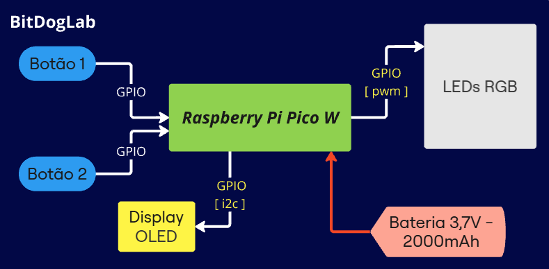
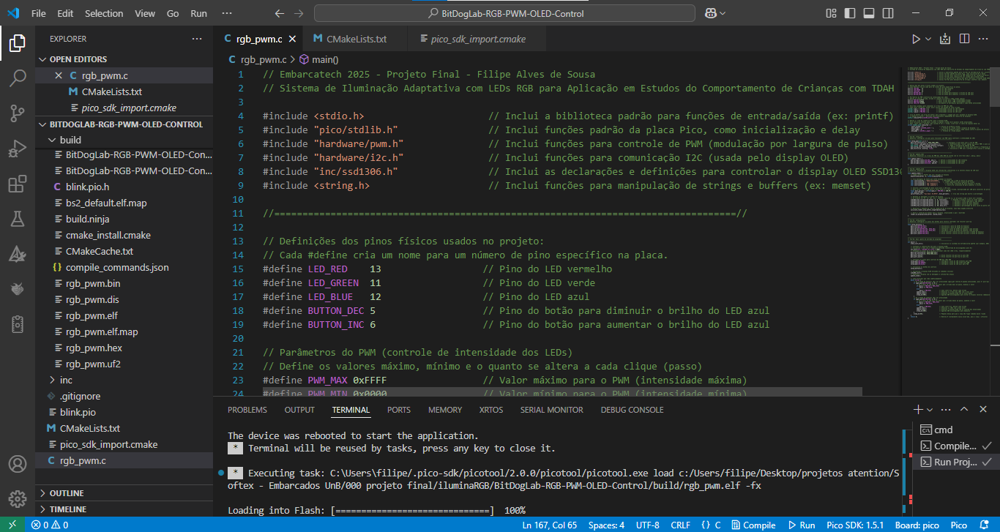

# Adaptive Lighting System with RGB LEDs for Studying the Behavior of Children with ADHD

## Instituto_Hardware_BR - Softex - Embarcatech - 2025

---

## 1. Introduction

Studies indicate that proper lighting significantly impacts the behavior and performance of students with Attention Deficit Hyperactivity Disorder (ADHD) [1][4]. Children with this disorder are highly sensitive to external stimuli, and exposure to environments with inadequate lighting can amplify symptoms of inattention, hyperactivity, and impulsivity. On the other hand, proper lighting adjustments can enhance concentration, reduce agitation, and promote a more conducive learning environment.

The objective of this project is to develop an accessible and programmable adaptive lighting system to support inclusive education, allowing educators to customize the classroom environment according to students' individual needs. The use of sensors and automated systems can aid in the emotional and behavioral self-regulation of these children [2].

The **BitDogLab** platform with **Raspberry Pi Pico W** was chosen for its cost-effective, efficient, and customizable implementation. The system enables manual adjustments and predefined lighting profiles, making it intuitive for teachers and school administrators. This project contributes to the development of more inclusive educational strategies, aligned with the needs of students with ADHD and other neurodevelopmental disorders.

---

## 2. General Objective

Develop an **adaptive lighting system** for classrooms, allowing personalized light adjustments to create an environment more suitable for emotional regulation, concentration, and reduced agitation in students with ADHD. The system will be based on the **BitDogLab** module with **Raspberry Pi Pico W**, enabling automated lighting control using **RGB LEDs**, dynamically adjusting to students' needs.

---

## 3. Block Diagram

(The system's block diagram should be included here)

    

---

## 4. Hardware and Software Requirements

### 4.1 Hardware

- **Raspberry Pi Pico W**
- **RGB LEDs**
- **Pushbuttons**
- **OLED Display**

### 4.2 Software

- Firmware developed in **C language** for system control.
- Configuration interfaces for lighting adjustments.

    

---

## 5. References

1. AMERICAN PSYCHIATRIC ASSOCIATION. DSM-5: Diagnostic and Statistical Manual of Mental Disorders. 5th ed. Arlington: APA, 2013.
2. SHELTON, S. H. *Teacher Perspectives on Classroom Lighting Conditions for Students with and without an ADHD Diagnosis*. 2020. Master's Thesis – Brenau University, Gainesville, 2020.
3. CIBRIAN, F. L.; LAKES, K. D.; SCHUCK, S. E. B.; HAYES, G. R. *The potential for emerging technologies to support self-regulation in children with ADHD: A literature review*. International Journal of Child-Computer Interaction, vol. 31, p. 100421, Mar. 2022.
4. SIMPSON, J. F. *The Calming Effects of Modified Lighting*. 2016. Ph.D. Thesis – University of Mississippi, Oxford, 2016.
5. LOVISA, M. *Multi-sensory environments adaptation for the relaxation of children with neurodevelopmental disorders*. 2017. Master's Thesis – Politecnico di Milano, 2017.
6. DAVIDSON, Z. C. M.; DANG, S.; VASILAKOS, X. *Blended Laboratory Design Using Raspberry Pi Pico for Digital Circuits and Systems*. IEEE Transactions on Learning Technologies, 2024.
7. FRUETT, F.; BARBOSA, F. P. S.; FRAGA, S. C. Z.; GUIMARÃES, P. I. A. *Empowering STEAM Activities With Artificial Intelligence and Open Hardware: The BitDogLab*. IEEE Transactions on Education, 2024.
8. VEITCH, J. A. *Psychological Processes Influencing Lighting Quality*. Journal of the Illuminating Engineering Society, vol. 30, no. 1, p. 124-140, 2001.
9. ÖZTÜRK, M. *A Predictive Control System for Indoor Lighting*. 2017. Bachelor's Thesis – University of Stuttgart, 2017.
10. YOUNG, H. D.; FREEDMAN, R. A. *Physics IV: Optics and Modern Physics*. Pearson Education do Brasil Ltda, 2016.
11. GREEN, K. *Light Sensitivity in ADHD: The Relationship with Hypersensitivity and Sensory Processing*. 2018. Available at: [Link](https://www.theraspecs.com/blog/adhd-light-sensitivity-hypersensitivity-sensory-processing). Accessed on 02/15/2025.
12. TIMOTEO. *Bitdoglab-C: Pico SDK applications for the BitDogLab, written in C*. Available at: [Link](https://github.com/BitDogLab/BitDogLab-C). Accessed on 02/15/2025.
13. SHABAZ. *PicoChroma - LED Lighting*. Available at: [Link](https://github.com/shabaz123/picochroma). Accessed on 02/15/2025.

---

## 6. Appendix

### 6.1 Video Presentation

[Watch the project presentation video](https://youtube.com/shorts/BVoW-QmkCpc)

---

## 7. File Structure

- **CMakeLists.txt** - CMake configuration
- **pico_sdk_import.cmake** - Pico SDK import
- **rgb_pwm.c** - LED control implementation

    

